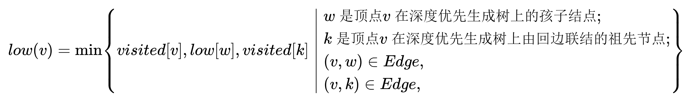

# 图的应用

## 最小生成树(Minimum-Spanning-Tree)

### MST性质

MST性质：假设 $N=(V,{E})$是一个连通图， $U$是顶点集 $V$的一个非空子集。若 $(u,v)$是一条具有最小权值的边，其中 $u\in U,v\in V-U$，则必存在一棵包含边 $(u,v)$的最小生成树。

**Proof：** 采用反证法，假设任何一颗最小生成树都不包含边 $(u,v)$。设 $T$是连通网上的一棵最小生成树，当边 $(u,v)$加入 $T$中时，由生成树的定义，必存在一条包含 $(u,v)$的回路。另一方面，由于 $T$是生成树，则在 $T$上必存在另一条边 $(u',v')$，且 $u$与 $u'$之间， $v$与 $v'$之间均有路径相通。删去边 $(u',v')$，则 $T'$的代价不高于 $T$，是一棵包含 $(u,v)$的最小生成树。由此与假设不符。

### Prim算法

- 从某一个顶点开始构建生成树；每次将代价最小的新顶点纳入生成树，直到所有顶点都纳入为止
- 时间复杂度： $O(|V|^{2})$
- 适用于边稠密图

### Kruskal算法

- 每次选择一条权值最小的边，使这条边的两头连通(原本已经连通的不选)，直至所有结点都连通
- 时间复杂度： $O(|E|log_2{|E|})$
- 适用于边稀疏图

## 关节点和重连通分量

### low[]的理解(要把回边考虑进来,因为对象是图,而不是生成树)

1. 当 $visited[]$定义完,我们已经把图(除了根节点)分成了不同的连通分量,因为如果有相连的边,必然会在同一棵子树上。
2. $low[]$的定义是后序遍历的过程, $low(v)$可以理解为忽略 $v$父结点与其他结点的边之后, $v$所在连通分量的结点最小序号
3. 对于某个顶点 $v$,存在孩子结点 $w$使得 $low[w]\geq visited[w]$。我们可以理解为 $w$只能通过 $v$才能与小序号结点相邻

## 最短路径问题

- 单源最短路径
  - BFS算法(无权图)
  - Dijkstra算法(带权图、无权图)
- 各顶点间的最短路径
  - Floyd算法(带权图、无权图)

### BFS算法

代码实现

    //求顶点u到其他顶点的最短路径
    void BFS_MIN_Distance(Graph G,int u){
        //d[i]表示从u到i结点的最短路径
        for(i=0;i<G.vexnum;++1){
            d[i]= ∞;
            path[i]=-1;
        }
        d[u]=0;
        visited[u]=TRUE;
        EnQueue(Q,u);
        while(!isEmpty(Q)){
            DeQueue(Q,u);
            for(w=FirstNeighbor(G,u);w=NextNeighbor(G,u,w))
                if(!visited(w)){
                    d[w]=d[u]+1;
                    path[w]=u;
                    visited[w]=TRUE;
                    EnQueue(Q,w);
                }
        }
    }

### Dijkstra算法

- 不适用于负权图
  其不适用于负权图的原因是算法只考虑了部分中转结点，也就是承认了中转结点变多必然会导致路径变长
- 时间复杂度： $O(|V|^{2})$

### Floyd算法

- 时间复杂度： $O(|V|^{3})$
- 空间复杂度： $O(|V|^{2})$
- 无法解决带有“负权回路”的图

## 有向无环图(Directed Acyclic Graph)

### DAG描述表达式

### 拓扑排序

AOV网(Activity On Vertex Network，用定点表示活动的网)————一定是DAG，不能有环

- 时间复杂度： $O(|V|+|E|)$;若采用邻接矩阵，则需 $O(|V|^{2})$
- 可用来判断是否有环

#### 拓扑排序的实现(DFS算法)

    bool visited[MAX_VERTEX_NUM];
    void DFSTraverse(Graph G){
        for(int i=0;i<G.vexnum;i++)
        visited[i]=false;
        int time=0;
        for(int i=0;i<G.vexnum;i++)
        if(!visited[i])DFS(G,i);
    }
    void DFS(Graph G,int v){
        visited[v]=true;
        visit(v);
        for(w=FirstNeighbor(G,v);w>=0;w=NextNeighbor(G,v,w)){
        if(!visited[w])
            DFS(G,w);
    }
        time++,finishTime[w]=true;
    }

### 逆拓扑排序

#### 逆拓扑排序的实现(DFS算法)

    void DFSTraverse(Graph G){
        for(v=0;v<G.vexnum;++v)
            visited[v]=FALSE;
        for(v=0;V<G.vexnum;++v)
            if(!visited[v]);
                DFS(G,v);
    }

    void DFS(Graph G,int v){
        visited[v]=TRUE;
        for(w=FirstNeighbor(G,v);w>=0;w=NextNeighbor(G,v,w))
            if(!visited[w]){
                DFS(G,w)；
            }
        print(v);
    }

## 关键路径

### AOE网(Activity On Edge NetWork，用边表示活动)

- 仅有一个入度为零的顶点，称为开始顶点，它表示整个工程的开始；也仅有一个出度为零的顶点，称为结束顶点(汇点)，它表示工程的结束
- 从源点到汇点的有向路径可能有多条，所有路径中，具有最大路径长度的路径称为**关键路径**，而关键路径上的活动称为**关键活动**
- 完成整个工程的最短时间就是关键路径的长度，若关键活动不能及时完成，则整个工程的完成时间就会延长

### 术语

- 事件 $v_{k}$的最早发生时间 $ve(k)$————决定了所有从 $v_{k}$开始的活动能够开工的最早时间
- 活动 $a_{i}$的最早开始时间 $e(i)$————指该活动弧的起点所表示的事件的最早发生时间
- 事件 $v_{k}$的最迟发生时间 $vl(k)$————它是指在不推迟整个工程完成的前提下，该事件最迟必须发生的时间
- 活动 $a_{i}$的最迟开始时间 $l(i)$————它是指该活动弧的终点所表示的最迟发生时间与该活动所需时间之差
- 活动 $a_{i}$的时间余量 $d(i)=l(i)-e(i)$，表示在不增加完成整个工程所需总时间的情况下，活动 $a_{i}$可以拖延的时间  
若一个活动的时间余量为零，则说明该活动必须要如期完成， $d(i)=0$的活动 $a_{i}$是**关键活动**  
由**关键活动**组成的路径就是**关键路径**

### 求关键活动和关键路径的流程

1. 求所有事件的最早发生时间 $ve(k)$
2. 求所有事件的最迟发生时间 $vl(k)$
3. 求所有活动的最早开始时间 $e(i)$
4. 求所有活动的最迟开始时间 $l(i)$
5. 求所有活动的时间余量 $d(i)=l(i)-e(i)$

### 关键活动、关键路径的特性

1. 若关键活动耗时增加，则整个工程的工期将增长
2. 缩短关键活动的时间，可以缩短整个工程的工期
3. 当缩短到一定程度时，关键活动可能会变成非关键活动
4. 可能有多条关键路径，只提高一条关键路径上的关键活动速度并不能缩短整个工程的工期
