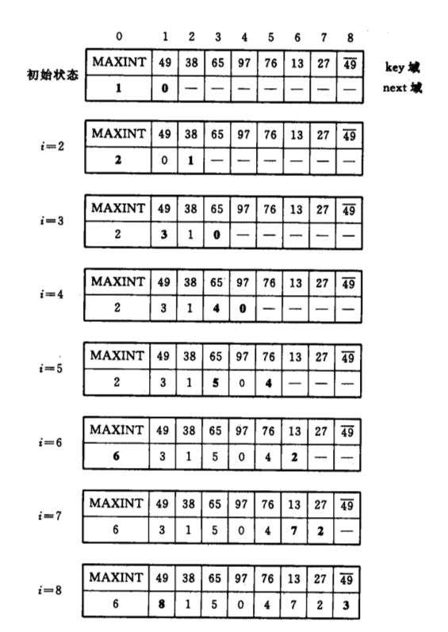
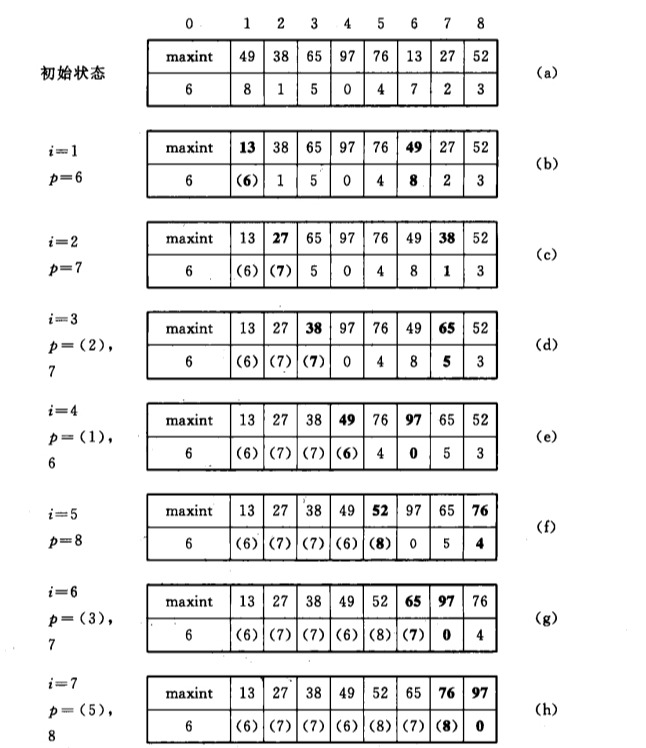
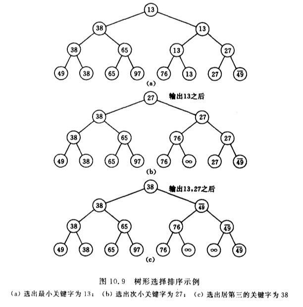

# 排序

## 排序的基本概念

- 将各元素按关键字递增/或递减顺序重新排列
- 评价指标
  - 稳定性：关键字相同的元素经过排序后相对顺序是否会改变
  - 时间复杂度、空间复杂度
- 分类
  - 内部排序：数据都在内存中
  - 外部排序：数据太多，无法全部放入内存中，需考虑磁盘读取次数

## 插入排序

### 插入排序(传统)

#### 算法实现

```c++
    //直接插入排序
    void InsertSort(int A[],int n){
        int i,j,temp;
        for(i=1;i<n;i++)
            if(A[i]<A[i-1]){
                temp=A[i];
                for(j=i-1;j>=0&&A[j]>temp;--j)
                    A[j+1]=A[j];
                A[j+1]=temp;
            }
    }

    //直接插入排序(带哨兵)
    void InsertSort(int A[],int n){
        int i,j;
        for(i=2;i<=n;i++)
            if(A[i]<A[i-1]){
                A[0]=A[i];
                for(j=i-1;A[0]<A[j];j--){
                    A[j+1]=A[j];
                }
                A[j+1]=A[0];
            }
    }
```

#### 算法效率分析

- 空间复杂度： $O(1)$
- 时间复杂度
  - 最好时间复杂度(顺序)： $O(n)$
  - 最坏时间复杂度(逆序)： $O(n^{2})$ $\rightarrow$ 比较次数 $\dfrac{n(n-1)}{2}$
  - 平均时间复杂度： $O(n^{2})$
- 算法稳定性：稳定

#### 优化算法

1. 折半插入排序

   - 算法思想：插入时使用折半查找
   - 算法实现

     ```c++
        //折半插入排序
        void InsertSort(int A[],int n)
            int i,j,low,high,mid;
            for(i=2;i<=n;i++){
                A[0]=A[i];
                low=1;high=i-1;
                while(low<=high){
                    mid=(low+high)/2;
                    if(A[mid]>A[0]) high=mid-1;
                    else  low=mid+1;
                }
                for(j=i-1;j>=low;--j)
                    A[j+1]=A[j];
                A[low]=A[0];
            }
     ```

   - 比起“直接插入排序”，比较关键字的次数减少了，但是移动元素的次数没变，整体来看时间复杂度仍然是 $O(n^{2})$

2. 2-路插入排序
   - 算法思想：设置一个辅助数组，将其看成一个循环向量通过两轮数组复制完成排序
   - 算法实现：

    ```c++
        void Two_Directions_Insert_sort(int nums[],int n){
            int *a=new int[n];
            a[0]=nums[0];int first=0,final=0;
            for(int i=1;i<n;i++){
            if(nums[i]<a[0]){
                if(first==0){       //第一个小于a[0]的数单独处理
                    first=n-1;a[first]=nums[i];
                }else{
                    int j=n-1;
                    while(j>=first&&a[j]>nums[i])   j--;
                    for(int k=first;k<=j;k++)   a[k-1]=a[k];
                    a[j]=nums[i];first=j;
                }
            }else{
                int j=0;
                while(j<=final&&a[j]<nums[i])   j++;
                for(int k=final;k>=j;k--)   a[k+1]=a[k];
                a[j]=nums[i];final=j;
                }
            }
            for(int i=0;i<n;i++)  nums[i]=a[(first+i)%n];
            delete[] a;
        }
    ```

    - 时间复杂度： $O(n^{2})$
    - 稳定性：稳定

3. 表插入排序
    - 排序算法思想：利用静态链表排序，算法示例过程

        

    - 对排序完的记录进行重排

        

    - 时间复杂度： $O(n^{2})$
    - 稳定性：稳定

### 希尔排序

#### 希尔排序的算法实现

```c++
    //希尔排序
    void ShellSort(int A[],int n){
        int d,i,j;
        //A[0]只是暂存单元，不是哨兵，当j<=0时，插入位置已到
        for(d=n/2;d>=1;d=d/2)   //步长变化
            for(i=d+1;i<=n;++i)
                if(A[i]<A[i-d]){
                    A[0]=A[i];
                    for(j=i-d;j>0 && A[0]<A[j]; j-=d)
                        A[j+d]=A[j];
                    A[j+d]=A[0];
                }
    }

```

#### 希尔排序性能分析

- 空间复杂度： $O(1)$
- 时间复杂度：和增量序列的选择有关，最坏时间复杂度为 $O(n^{2})$，当n在某个范围时，可达 $O(n^{1.3})$
- 稳定性：不稳定
- 适用性：仅适用于顺序表，不适用于链表

## 交换排序

### 冒泡排序

#### 冒泡排序算法实现

```c++
    //交换
    void swap(int &a,int &b){
        int temp=a;
        a=b;
        b=temp;
    }

    //冒泡排序
    void BubbleSort(int A[],int n){
        for(int i=0;i<n-1;i++){
            bool flag=false;
            for(int j=n-1;j>i;j--)
                if(A[j-1]>A[j]){
                    swap(A[j-1],A[j]);
                    flag=true;
                }
            if(flag=false)
                return;        
        }    
    }
```

#### 冒泡排序性能分析

- 空间复杂度： $O(1)$
- 时间复杂度
  - 最好情况(有序)：比较次数= $n-1$，交换次数= $0$，最好时间复杂度= $O(n)$
  - 最坏情况(逆序)：比较次数=交换次数= $(n-1)+(n-2)+\cdots+1=\dfrac{n(n-1)}{2}$，最坏时间复杂度= $O(n^{2})$
  - 平均时间复杂度= $O(n^{2})$
- 稳定性：稳定的，每次冒泡会有一个记录放在最终位置上
- 适用性：适用于链表

### 快速排序

#### 快速排序算法实现

```c++
    //用第一个元素将待排序序列划分为左右两个部分
    int Partition(int A[],int low,int high){
        int pivot=A[low];
        while(low<high){
            while(low<high&&A[high]>=pivot) high--;
            A[low]=A[high];
            while(low<high&&A[low]<=pivot)  low++;
            A[high]=A[low];
        }
        A[low]=pivot;
        return low;
    }

    //快速排序
    void QuickSort(int A[],int low,int high){
        if(low<high){
            int pivotpos=Partition(A[],low,high);
            QuickSort(A,low,pivotpos-1);
            QuickSort(A,pivotpos+1,high);
        }
    }
```

#### 快速排序算法效率分析

- 时间复杂度 $=O(n\times\text{递归层数})$
  - 最好时间复杂度 $=O(n\log_2{n})$ $\rightarrow$ 每次选的枢轴元素都能将序列划分成均匀的两部分
    - 选头、中、尾三个位置的元素，取中间值作为枢轴元素
    - 随机选一个元素作为枢轴元素
  - 最坏时间复杂度 $=O(n^{2})$ $\rightarrow$ 若序列原本就有序或者逆序，则时间复杂度、空间复杂度最高(可优化，尽量选择可以把数据中分的枢轴元素)
  - 平均时间复杂度 $=O(n\log_2{n})\rightarrow$ **快速排序是所有内部排序算法中平均性能最优的排序算法，在同数量级的此类排序方法中，快速排序的常数因子最小**
- 空间复杂度 $=O(\text{递归层数})$
  - 最好空间复杂度 $=O(\log_2{n})$
  - 最坏空间复杂度 $=O(n)$
  - 平均情况： $=O(\log_2{n})$
- 稳定性：不稳定

#### tips

关注“一趟”排序和一次“划分”是否相同

## 选择排序

### 简单选择排序

每一趟在待排序元素中选取关键字最小的元素加入有序子序列

#### 简单选择排序算法实现

```c++
    //简单选择排序
    void SelectSort(int A[],int n){
        for(int i=0;i<n-1；i++){
            int min=i;
            for(int j=i+1;j<n;j++)
                if(A[min]>A[j]) min=j;
            if(min!=i)  swap(A[min],A[i]);
        }
    }
```

#### 简单选择排序算法性能分析

- 空间复杂度： $O(1)$
- 时间复杂度： $O(n^{2})$
  - 共需要对比关键字次数 $\dfrac{n(n+1)}{2}$
- 稳定性：不稳定
- 适用性：顺序表、链表

### 树形选择排序

- 即锦标赛排序，算法过程可以用一棵n个叶子结点的完全二叉树表示。例子如下
    
- 算法评价：
  - 时间复杂度： $O(n\log{n})$
  - 缺点：辅助存储空间较多，和“最大值”进行多于的比较等。由此引出堆排序
  - 稳定性：不稳定

### 堆排序

#### 什么是“堆”(Heap)

若n个关键字序列 $L[1\cdots n]$满足下面某一条性质，则称为**堆(Heap)**

1. 若满足： $L(i)\geq L(2i)且L(i)\geq L(2i+1)\quad (1\leq i\leq n/2)$——大根堆(大顶堆)
2. 若满足： $L(i)\leq L(2i)且L(i)\leq L(2i+1)\quad (1\leq i\leq n/2)$——小根堆(小顶堆)

#### 建立大根堆

- 思路：把所有非终端结点都检查一遍，是否满足大根堆的要求，如果不满足，则进行调整
- 检查当前结点是否满足**根 $\geq$左、右**，若不满足，将当前结点与更大的一个孩子互换

##### 建立大根堆(代码)

```c++
    //建立大根堆
    void BuildMaxHeap(int A[],int len){
        for(int i=len/2;i>0;i--)
            HeadAdjust(A,i,len);
    }
    //将在以k为根的子树里找到k的位置
    void HeadAdjust(int A[],int k,int len){
        A[0]=A[k];
        for(int i=2*k;i<=len;i*=2){
            if(i<len&&A[i]<A[i+1])
                i++;
            if(A[0]>A[i])   break;
            else {
                A[k]=A[i];
                k=i;
                }
        }
        A[k]=A[0];
    }
```

#### 基于大根堆进行排序

- 每一趟将堆顶元素加入有序子序列(与待排序序列中的最后一个元素交换)，并将**待排序元素序列再次调整为大根堆**

#### 基于大根堆进行排序代码

```c++
    //堆排序的完整逻辑
    void HeapSort(int A[],int len){
        BuildHeap(A,len);
        for(int i=len;i>1;i--){
            swap(A[i],A[1]);
            HeadAdjust(A,1;i-1);
        }
    }
```

#### 堆排序算法效率分析

**结论：**

- 一个结点，每“下坠”一层，最多只需对比关键字2次
- 若树高为h，某结点在第i层，则将这个结点向下调整最多只需要“下坠”h-i层，关键字对比次数不超过2(h-1)
- n个结点的完全二叉树树高 $h=\lfloor \log_2{n}\rfloor+1$
- 适用于n较大的情况

**建堆时间：**

第i层最多有 $2^{i-1}$个结点，而只有第1~(h-1)层的结点才有可能需要“下坠”调整  
将整棵树调整为大根堆，关键字对比次数
$$\sum\limits_{i=h-1}^{1}2^{i-1}2(h-i)=\sum\limits_{i=h-1}^{1}2^{i}(h-i)=\sum\limits_{j=1}^{h-1}2^{h-j}j\leq 2n\sum\limits_{j=1}^{h-1}\dfrac{j}{2^{j}}\leq 4n(错位相减法)$$

建堆的过程，关键字对比次数不超过4n，建堆时间复杂度= $O(n)$

**堆排序的时间复杂度：** $=O(n)+O(n\log_2{n})=O(n\log_2{n})$，即使在最坏情况下时间复杂度也为 $O(n\log_2{n})$

**堆排序的空间复杂度：** $=O(1)$

**稳定性**：不稳定

#### 堆的插入和删除

- 堆的删除：先用堆底元素代替被删除元素，再恢复堆

## 两个其他排序算法

### 归并排序(Merge Sort)

```c++
    int *B=(int *)malloc(n*sizeof(int));//辅助数组B

    //A[low...high]和A[mid+1...high]各自有序，将两个部分归并
    void Merge(int A[],int low,int mid,int high){
        int i,j,k;
        for(k=low;k<=high;k++)
            B[k]=A[k];
        for(i=low,j=mid+1,k=low;k<=high;k++){
            if(B[i]<B[j]){
                A[k]=B[i];
                i++;
            }  else{
                A[k]=B[j];
                j++;
            }
        }
        while(i<=mid)    A[k++]=B[i++];
        while(j<=high)   A[k++]=B[j++];
    }

    void MergeSort(int A[],int low,int high){
        if(low<high){
            mid=(low+high)/2;
            MergeSort(A,low,mid);
            MergeSort(A,mid+1,high);
            Merge(A,low,mid,high);
        }
    }
```

#### 归并排序算法效率分析

**结论：** n个元素进行2路归并排序，归并趟数 $=\lceil \log_2{n}\rceil$

**时间复杂度：** 每趟归并时间复杂度 $O(n)$，则算法的时间复杂度 $O(n\log_2{n})$

**空间复杂度：** $O(n)\rightarrow$辅助数组: $O(n)$，递归深度: $O(\log_2{n})$

**稳定性：** 稳定

### 基数排序

#### 多关键字的排序

- LSD：实质上是高位决定低位
- MSD：递归分堆，有序合并

#### 基数排序算法效率分析

- 空间复杂度： $O(r)\rightarrow$ 需要r个辅助队列
- 时间复杂度： $O(d(n+r))\rightarrow$ 一趟分配 $O(r)$，一趟收集 $O(r)$，总共d趟分配、收集
- 稳定性：稳定的

#### 基数排序的适用

- 数组元素的关键字可以方便地拆分为d组，且d较小
- 每组关键字的取值范围不大，即r较小
- 数据元素个数n较大

## 各种内部排序方法的比较讨论

| 排序方法 | 平均时间 | 最坏情况 | 辅助存储 | 稳定性 | 适用性 |
|:---------:|:---------:|:---------:|:--------:|:---------:|:-------|
|  简单排序 **(除去希尔排序)** | $O(n^{2})$ |  $O(n^{2})$ | $O(1)$ | 稳定 | 当序列中的记录“基本有序”或n值较小时，直接插入排序是最佳的排序方法 |
| 希尔排序 | $O(n^{1.3})$ | $O(n^{2})$ | $O(1)$ | 不稳定 |
|  快速排序 |  $O(n\log{n})$ |  $O(n^{2})$ | $O(\log{n})$ | 不稳定 |
| 冒泡排序 | $O(n^{2})$ | $O(n^{2})$ | $O(1)$ | 稳定 |
|  堆排序 |  $O(n\log{n})$ |  $O(n\log{n})$ | $O(1)$  | 不稳定 | n值很大 |
| 归并排序 | $O(n\log{n})$ | $O(n\log{n})$ | $O(n)$ | 稳定 |
|基数排序 | $O(d(n+r))$ | $O(d(n+r))$ | $O(r)$ | 稳定 | n值很大 |

**Tip:** 借助于“比较”进行排序的算法在最坏情况下能达到的最好的时间复杂度为 $O(n\log{n})$
