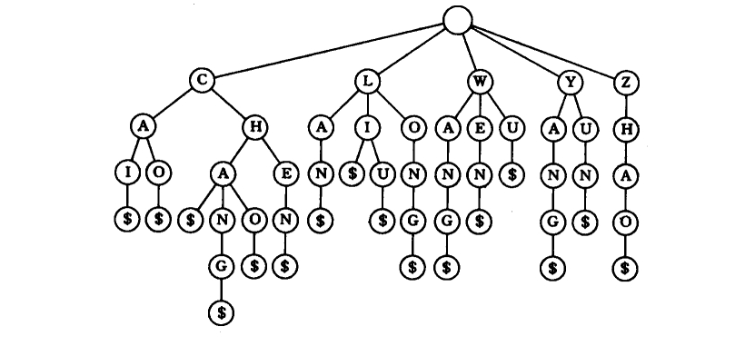
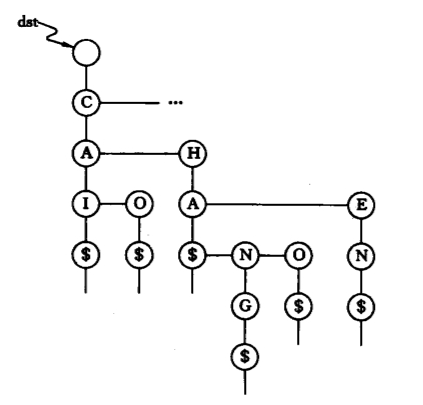

# B树和B+树

## B树

### 如何保证查找效率

- 策略：m叉查找树中，规定除了根节点外，任何结点至少有 $\lceil m/2 \rceil$个分叉，即至少有 $\lceil m/2 \rceil-1$个关键字
- 策略：m叉查找树中，规定对于任何一个结点，其所有子树的高度都要相同

### B树的定义

B树，又称多路平衡查找树，B树中所被允许的孩子个数的最大值称为B树的阶，通常用m表示。一棵m阶B树或为空树，或为满足以下特性的m叉树：

- 树中每个结点至多有m棵子树，即至多含有m-1个关键字
- 若根结点不是终端结点，则至少有两棵子树
- 除了根节点外，任何结点至少有 $\lceil m/2 \rceil$个分叉，即至少有 $\lceil m/2 \rceil-1$个关键字
- 所有的叶结点都出现在同一层次上，并且不带信息
- 非叶结点的结构如下：

  | $n$ | $P_{0}$ | $K_{1}$ | $P_{1}$ | $K_{2}$ | $P_{2}$ | $\dots$ | $K_{n}$ | $P_{n}$ |

  实际上在B树的每个结点中还应包含n个指向每个关键字的记录的指针

### B树的高度

*注*：大部分学校B树的高度不包括叶子结点(失败结点)，严书中B树的高度包括叶子节点

#### 最小高度--让每个结点尽可能的满

有m-1个关键字，m个分叉，则有 $n\leq (m-1)(1+m+m^{2}+m^{3}+\cdot+m^{h-1})=m^{h}-1$，因此 $h\geq log_m{(n+1)}$

#### 最大高度--让各层的分叉尽可能的少

根节点只有两个分叉其他结点只有2个分叉，其他结点只有 $\lceil m/2 \rceil$个分叉。各层结点至少有：1、2、 $2\lceil m/2 \rceil$、 $\cdots$、 $2(\lceil m/2 \rceil)^{h-2}$
  
  第h+1层共有叶子结点(失败结点) $2(\lceil m/2 \rceil)^{h-1}$个  
  n个关键字的B树必有n+1个叶子结点 **(n个关键字将数域切分为n+1个区间)**，则 $n+1\geq 2(\lceil m/2 \rceil)^{h-1}$，即 $h\leq \log_{\lceil m/2\rceil}\frac{n+1}{2}+1$

### B树的插入

- 新元素一定是插入最底层“终端结点”，用“查找来确定插入位置”
- 在插入key后，若导致原结点关键字数超过上限，则从中间位置( $\lceil m/2 \rceil$)将其中的关键字分为两部分，左部分包含的关键字放在原结点中，右部分包含的关键字放到新结点中，中间位置( $\lceil m/2 \rceil$)的结点插入原结点的父结点。若此时导致其父结点的关键字个数也超过了上限，则继续这种分裂操作，直至这个操作传到根结点为止，进而导致B树高度增加1

### B树的删除

- **非终端结点关键字：** 用其直接前驱或直接后继替代其位置，转化为对“终端结点”的删除
- **终端结点关键字：**
  - **删除后结点关键字个数未低于下限：** 无需任何处理
  - **低于下限：**
    - 右兄弟够借，则用当前结点的后继、后继的后继依次顶替空缺
    - 左兄弟够借，则用当前结点的前驱、前驱的前驱依次顶替空缺
    - 左右兄弟都不够借，则需要与父结点内的关键字、左右兄弟进行合并。合并后导致父节点关键字-1，可能需要继续合并

## B+树

### B+树的定义

一棵m阶的B+树需满足下列条件：

1. 每个分支结点最多有m棵子树(孩子结点)
2. 非叶根结点至少有两棵子树，其他每个分支结点至少有 $\lceil m/2 \rceil$棵子树
3. 结点的子树个数与关键字个数相等
4. 所有叶结点包含全部关键字及指向相应记录的指针，叶结点中将关键字按大小顺序排列，并且相邻叶结点按大小顺序相互链接起来
5. 所有分支结点中仅包含它的各个字结点中关键字的最大值及其指向其子结点的指针

B+树的阶数通常取奇数，方便对叶子结点进行分裂

## 键树

### 键树的定义

**键树**又称数字查找树(Digital Search Trees)。它是一颗度 $\geq$ 2的树，书中每个结点中不是包含一个或几个关键字，而是只包含组成关键字的符号。

- 约定键树是有序树，即同一层中兄弟结点之间依所含符号自左向右有序
- 约定结束符$小于任何字符

对于含有16个关键字的集合{CAI、CAO、LI、LAN、CHA、CHANG、WEN、CHAO、YUN、YANG、LONG、WANG、ZHAO、LIU、WU、CHEN}，对应的键树如下

## 键树的存储结构

### 孩子兄弟链表(双链树)

- 分支结点
  - symbol域
  - first域
  - next域
- 叶子节点
  - infoptr：存储指向该关键字记录的指针

#### 性能分析

- 每个节点的最大度d和关键字的“基”有关，(单词---d=27；数值---d=11)
- 深度取决于关键字中字符或数位的个数
- 查找每一位的平均查找长度为 $\dfrac{1}{2}(1+d)$，查找关键字的平均查找长度为 $\dfrac{h}{2}(1+d)$

### 多重链表(Trie树)

- 分支结点
  - 含有d个指针域和一个指示该节点中非空指针域的个数的整数域
  - 不设数据域，每个分支结点所表示的字符均由其双亲结点中指向该结点的指针所在位置决定
- 叶子节点：含有关键字域和指向记录的指针域

#### 改进

减少树的深度

- 选择合适的分割
- 设置最大深度为 $l$，则所有直至 $l-1$层皆为同义词的关键字都进入同一叶子结点。
- 增加分支个数
