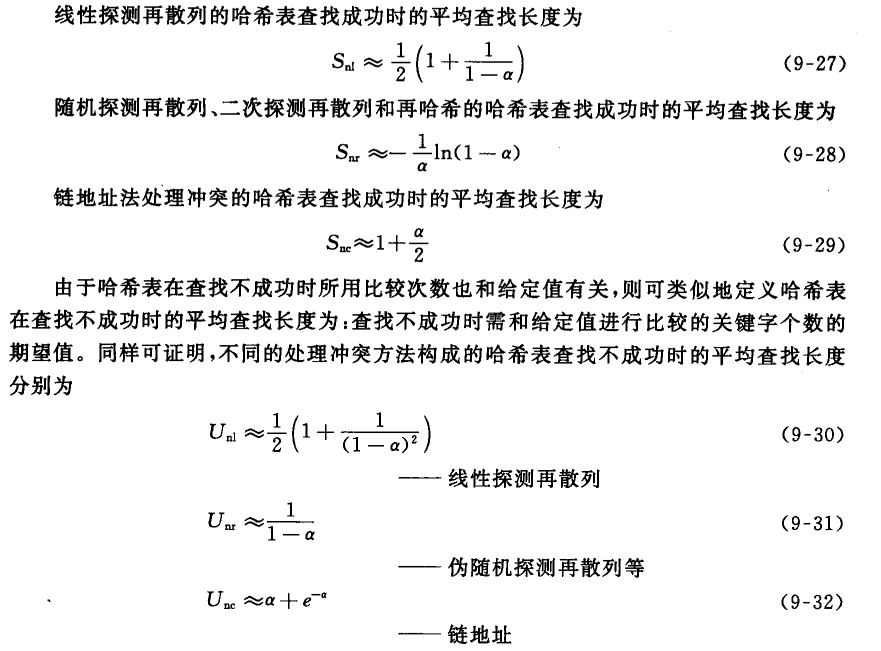

# 散列表

## 设计散列函数

### 设计散列函数时应该注意什么

1. 定义域必须涵盖所有可能出现的关键字
2. 值域不能超出散列表的地址范围
3. 尽可能减少冲突。散列函数计算出来的地址应尽可能均匀分布在整个地址空间
4. 散列函数应尽可能简单，能够快速计算出任意一个关键字对应的散列地址

### 除留余数法(通用，关键字为整数即可)

散列表表长为m，取一个不大于m但最接近或等于m的质数p或不包含小于20的质因数的合数

### 直接定址法(关键字分布基本连续)

$$H(key)=a*key+b$$

### 数字分析法(关键字集合已知，且关键字的某几个数码位分布均匀)

选取数码分布较为均匀的若干位作为散列地址

### 平方取中法——取关键字的平方值的中间几位作为散列地址(关键字的每位取值都不够均匀)

### 折叠法——将关键字分割成位数相同的几部分(最后一部分的位数可以不同)，然后取这几部分的叠加和(舍去进位)作为哈希地址(关键字位数很多，而且关键字中每一位上数字分布大致均匀时)

### 随机数法——选择一个随机函数，取关键字的随机函数值作为它的哈希地址(关键字长度不等时)

## 处理冲突的方法

### 建立一个公共溢出区

一旦发生冲突就放入溢出区

### 再哈希法

$$H_{i}=RH_{i}(key),i=1,2,\cdots,k$$

### 拉链法

- 在分析查找长度时，通常只统计“关键字的对比次数”，而链表“空指针的对比次数”不计入查找长度

### 开放定址法

$$H_{i}=(H(key)+d_{i}) \% m$$

$$0\leq i \leq m-1$$

#### 线性探测法

$$d_{i}=0,1,2,3,\cdots,m-1$$

##### 查找

- 根据探测序列依次对比各存储单元内的关键字
  - 若探测到目标关键字，则查找成功
  - 若探测到空单元，则查找失败

#### 平方/二次探测法

$$d_{i}=0^{2},1^{2},-1^{2},2^{2},-2^{2},\cdots,k^{2},-k^{2}$$

$$\text{其中}k\leq m/2$$

##### 查找过程

- 根据探测序列依次对比各存储单元内的关键字
  - 若探测到目标关键字，则查找成功
  - 若探测到空单元，则查找失败

#### 双散列法

$$d_{i}=i\times hash_{2}(key)$$

##### 查找(类似)

#### 伪随机序列

$$d_{i}\text{是一个伪随机序列}$$

#### 删除元素

1. 先根据散列函数算出散列地址，并对比关键字是否匹配。若匹配，则“查找成功”
2. 若关键字不匹配，则根据“探测序列”对比下一个地址的关键字，直到“查找成功”或“查找失败”
3. 若“查找成功”，则删除找到的元素

##### 注意

- 采用“开放定址法”时，删除元素不能简单地将被删元素的空间置为空，否则将截断在它之后的探测路径，可以做一个“已删除”标记，进行逻辑删除。
- 新元素可以插入到已被“逻辑删除”的地址

#### 探测覆盖率

- 经过m-1次冲突，一定能探测到散列表的所有单元
- 若散列表长度m是一个可以表示成4j+3的素数，平方探测法就能探测到所有位置
- 双散列法的探测覆盖率取决于第二个散列函数设计的是否合理：若 $hash_{2}(key)$计算得到的值与散列表表长m互质，就能保证双散列法可以探测所有单元
  - 常用方法：令表长m本身就是质数， $hash_{2}(key)=m-key\bmod m$

## 平均查找长度

在散列表中，平均查找长度与装填因子 $\alpha$直接相关，表的查找效率不直接依赖于表中已有的表项个数或表长

## 一些tip

- 聚集现象是因选取不当的处理冲突的方法，而导致不同关键字的元素对同一散列地址进行争夺的现象。用线性再探测法时，容易引发聚集现象
- 计算查找失败时的平均查找长度，一定要注意散列函数的值域
