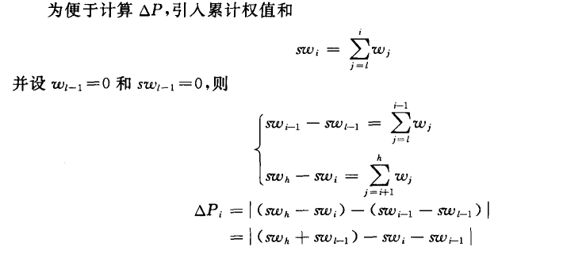

# 静态查找表

## 顺序查找

时间复杂度： $O(n)$

### 顺序查找的实现

#### 哨兵算法

    typedef struct{
        ElemType *elem;    //动态数组基址
        int TableLen;      //表的长度
    }SSTable               //Sparse Sorted Table

    //顺序查找
    int Search_Seq(SSTable ST,ElemType key){
        ST.elem[0]=key;    //哨兵
        int i;
        for(i=ST.Tablelen;ST.elem[i]!=key;--i);
        return i;
    }

#### 执行效率(ASL)

- 查找成功:  $ASL_{成功}=\frac{n+1}{2}$ -- $O(n)$
- 查找失败: $ASL_{失败}=n+1$

### 顺序查找的优化

#### 查找判定树(有序表)

$ASL_{失败}=\frac{n}{2}+\frac{n}{n+1}$ -- $O(n)$

#### 被查概率大的放在靠前位置(被查概率不相等)

## 折半查找(仅适用于有序的顺序表)

### 折半查找的实现

    typedef struct{
        ElemType *elem;
        int TableLen;
    }SSTable;

    //折半查找
    int Binary_Search(SSTable L,ElemType key){
        int low=0,high=L.TableLen-1,mid;
        while(low<=high){
            mid=(low+high)/2;
            if(L.elem[mid]==key)
                return mid;
            if(L.elem[mid]<key)
                low=mid+1;
            else
                high=mid-1;
        }
        return -1;
    }

### 查找效率分析

查找成功时的平均查找长度

$$ASL_{bc}=\sum\limits_{i=1}^{n}P_{i}C_{i}=\dfrac{1}{n}\sum\limits_{j=1}^{h}j\cdot 2^{j-1}=\dfrac{n+1}{n}\log_2{(n+1)}-1$$

时间复杂度： $O(log_2{n})$

折半查找的速度~~一定~~大多数情况下比顺序查找更快

#### 折半查找判定树的构造

- 右子树结点树-左子树结点树=0或1
- 折半查找的判定树**一定是平衡二叉树**
- 折半查找的判定树中，**只有最下面一层是不满的**,因此元素个数为n时**树高 $h=\lceil log_2{(n+1)} \rceil$**(不包含失败节点)
- 失败结点:n+1个
- 满足二叉排序树的定义

## 斐波那契查找(仅适用于有序的顺序表)

假设开始时表中记录个数比某个斐波那契数小1，即 $n=F_{u}-1$，然后将给定值 $key$和 $ST.elem[F_{u-1}].key$进行比较，若相等，则查找成功；若 $key < ST.elem[F_{u-1}].key$，则继续在自 $ST.elem[1].key$至 $ST.elem[F_{u-1}-1].key$的子表中进行查找，否则继续在自 $ST.elem[F_{u-1}+1].key$至 $ST.elem[F_{u}-1].key$的子表中进行查找，后一子表的长度为 $F_{u-2}-1$。

### 查找效率

平均性能比折半查找好，但最坏情况下的性能(虽然仍是 $O(\log{n})$ )却比折半查找差。还有一个优点是分割时只做加减法运算。

## 插值查找(仅适用于有序的顺序表)

插值查找是根据给定值key来确定进行比较的关键字 $ST.elem[i].key$的查找方法。令 $$i=\dfrac{key-ST.elem[l].key}{ST.elem[h].key-ST.elem[l].key}(h-l+1)$$，其中 $ST.elem[l].key$和 $ST.elem[h].key$分别为有序表中具有最小关键字和最大关键字的记录。

### 性能分析

只适用于关键字均匀分布的表，在这种情况下，对表长较大的顺序表，其平均性能比折半查找好。

## 静态树表的查找

**近似最优查找树(次优查找树)的有效算法：**

已知一个按关键字有序 **(递增)** 的记录序列 $(r_{l},r_{l+1},\cdots,r_{h})$与每个记录相应的权值为 $w_{l},w_{l+1},\cdots,w_{h}$。

在记录序列中取第 $i(l\leq i\leq h)$个记录构造根节点，使得
$$\Delta P_{i}=\vert \sum\limits_{j=i+1}^{h}w_{j}-\sum\limits_{j=l}^{i-1}w_{j} \vert$$

取最小值。对子序列递归进行此操作。

计算步骤:

## 分块查找

特点：块内无序、块间有序

### 数据结构

    //索引表
    typedef struct{
        ElemType maxValue;
        int low,high;
    }Index;

    //顺序表存储实际元素
    ElemType List[100];

### 分块查找，又称索引顺序查找，算法过程如下

1. 在索引表中确定待查元素所属的分块(可顺序、可折半)
2. 在块内顺序查找

#### 用折半查找查索引

- 若索引表中不包括目标关键字，则折半查找索引表最终停在low>high，要在**low所指分块中查找**

  - 原因: 最终low左边一定小于目标关键字，high右边一定大于目标关键字。而分块存储的索引表中保存的是各个分块的最大关键字

### 索引顺序表查找效率

假设，长度为n的查找表被均匀地分为b块，每块s个元素  
设索引查找和块内查找的平均查找长度分别为 $L_{I},L_{S}$，则分块查找的平均查找长度为 $ASL=L_{I}+L_{S}$  

- 用顺序表查索引表，则 $L_{I}=\frac{b+1}{2},L_{S}=\frac{s+1}{2}$  
则 $ASL=\frac{s^{2}+2s+n}{2s}$，当 $s=\sqrt{n}$时， $ASL_{最小}=\sqrt{n}+1$
- 用折半查找查索引表， $ASL=\lceil log_2{(b+1)} \rceil+\dfrac{s+1}{2}$
